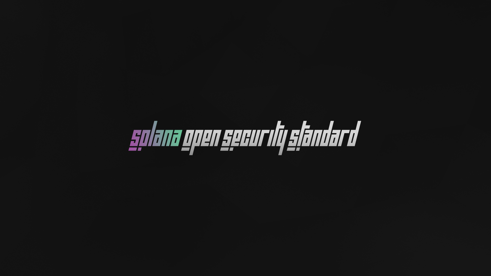

## Solana Open Security Standard

Solana Open Security Standard (SOSS) is a proposition of a security awareness standard for Solana. We wish to make a consensus about the most common security risks of Solana programs.

This document is free and open to anyone interested in Solana security. SOSS aims to educate Solana developers and organizations about security and the consequence of weaknesses.

Solana Open Security Standard is created by the company OPCODES, but we want the standard to remain neutral and free from any commercial pressure. This is why SOSS will never endorse or recommend specific products or services, even ours.

The reports can be found in the [Reports](./Reports) folder.

[Link to the Data used](https://docs.google.com/spreadsheets/d/1RSMeMVelBddjJbStoFjjolHdUIAc2vgVYR8pGYES9o0/)